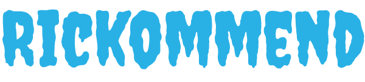

<!-- REPLACE ALL THE [WiaanDuvenhage-200307] TEXT WITH YOUR GITHUB PROFILE NAME & THE [rickommend] WITH THE NAME OF YOUR GITHUB PROJECT -->

<!-- Repository Information & Links-->
<br />


<!-- HEADER SECTION -->
<h5 align="center" style="padding:0;margin:0;">Wiaan Duvenhage</h5>
<h5 align="center" style="padding:0;margin:0;">200307</h5>
<h6 align="center">SEO - Term 1 | 2022</h6>
</br>
<p align="center">

  <a href="https://github.com/WiaanDuvenhage-200307/rickommend">
    
  </a>
  
  <h3 align="center">Rickommend</h3>

  <p align="center">
    An SEO Project built using HTML, CSS, JavaScript and the Bulma framework <br>
    
   <br />
   <br />
   <a href="path/to/demonstration/video">View Demo</a> <!-- !Upload Youtube Video to paste here -->
    ·
    <a href="https://github.com/WiaanDuvenhage-200307/rickommend/issues">Report Bug</a>
    ·
    <a href="https://github.com/WiaanDuvenhage-200307/rickommend/issues">Request Feature</a>
</p>
<!-- TABLE OF CONTENTS -->

## Table of Contents

- [About the Project](#about-the-project)
  - [Project Description](#project-description)
  - [Built With](#built-with)
- [Getting Started](#getting-started)
  - [Prerequisites](#prerequisites)
  - [How to install](#how-to-install)
- [Features and Functionality](#features-and-functionality)
- [Concept Process](#concept-process)
  - [Ideation](#ideation)
  - [Wireframes](#wireframes)
  - [Custom UI](#user-flow)
- [Development Process](#development-process)
  - [Implementation Process](#implementation-process)
    - [Highlights](#highlights)
    - [Challenges](#challenges)
  - [Future Implementation](#peer-reviews)
- [Final Outcome](#final-outcome)
  - [Mockups](#mockups)
  - [Video Demonstration](#video-demonstration)
- [Conclusion](#conclusion)
- [License](#license)
- [Contact](#contact)
- [Acknowledgements](#acknowledgements)

<!--PROJECT DESCRIPTION-->

## About the Project

<!-- header image of project -->



### Project Description

A nice introduction to this amazing project of mine.

### Built With

- [HTML](https://whatwg.org/)
- [CSS](https://www.w3.org/Style/CSS/Overview.en.html)
- [JavaScript](path/to/technology/website)
- [Bulma](https://bulma.io/)

<!-- GETTING STARTED -->
<!-- Make sure to add appropriate information about what prerequesite technologies the user would need and also the steps to install your project on their own mashines -->

## Getting Started

The following instructions will get you a copy of the project up and running on your local machine for development and testing purposes.

### Installation

Here are a couple of ways to clone this repo:

1.  GitHub Desktop </br>
    Enter `https://github.com/WiaanDuvenhage-200307/rickommend.git` into the URL field and press the `Clone` button.

2.  Clone Repository </br>
    Run the following in the command-line to clone the project:

    ```sh
    git clone https://github.com/WiaanDuvenhage-200307/rickommend.git
    ```

        Open `Software` and select `File | Open...` from the menu. Select cloned directory and press `Open` button

<!-- FEATURES AND FUNCTIONALITY-->
<!-- You can add the links to all of your imagery at the bottom of the file as references -->

## Features and Functionality

<!-- note how you can use your gitHub link. Just make a path to your assets folder -->


### All the characters shown on Rick and Morty!

Using the Rick and Morty API, we are displaying the characters, which the user can randomise again.


### Feature 2

Description of Feature

![image4][image4]

### Feature 3

Description of Feature

![image5][image5]

<!-- CONCEPT PROCESS -->
<!-- Briefly explain your concept ideation process -->
<!-- here you will add things like wireframing, data structure planning, anything that shows your process. You need to include images-->

## Concept Process

The `Conceptual Process` is the set of actions, activities and research that was done when starting this project.

### Ideation

![image5][image5]
<br>
![image6][image6]

### Custom UI

![image8][image8]

<!-- DEVELOPMENT PROCESS -->

## Development Process

The `Development Process` is the technical implementations and functionality done in the frontend and backend of the application.

### Implementation Process

<!-- stipulate all of the functionality you included in the project -->
<!-- This is your time to shine, explain the technical nuances of your project, how did you achieve the final outcome!-->

- I used Bulma to implement resposiveness to my web app, so that it can be viewable on both desktop and mobile.
- Implemented Routing with `React-Router v6`.
- API End Point: link Here
- `Plugin` for this.
- ETC.

#### Highlights

<!-- stipulated the highlight you experienced with the project -->

- What was good about this project, what did you learn.
- What aspects did you enjoy.

#### Challenges

<!-- stipulated the challenges you faced with the project and why you think you faced it or how you think you'll solve it (if not solved) -->

- Bugs.
- Bugs.

#### Above And Beyond

What aspects of this final build contribute to the `Above And Beyond` Component of your brief?

<!-- what did you learn outside of the classroom and implement into your project-->

- Name of Skill Explored.
- Explain your understanding and execution of above skill.

### Future Implementation

<!-- stipulate functionality and improvements that can be implemented in the future. -->

- Future 1.
- Future 2.

<!-- MOCKUPS -->

## Final Outcome

### Mockups

![image9][image9]
<br>
![image10][image10]

<!-- VIDEO DEMONSTRATION -->

### Video Demonstration

To see a run through of the application, click below:

[View Demonstration](path/to/video/demonstration)

See the [open issues](https://github.com/WiaanDuvenhage-200307/rickommend/issues) for a list of proposed features (and known issues).

<!-- AUTHORS -->

## Authors

- **Your Name & Surname** - [Wiaan Duvenhage](https://github.com/WiaanDuvenhage-200307)

<!-- LICENSE -->

## License

Distributed under the MIT License. See `LICENSE` for more information.\

<!-- LICENSE -->

## Contact

- **Your Name & Surname** - [email@address](mailto:wiaanduvenhage.dev@gmail.com) - [@instagram_handle](https://www.instagram.com/double.u.dee.designs/)
- **Project Link** - https://github.com/WiaanDuvenhage-200307/rickommend

<!-- ACKNOWLEDGEMENTS -->

## Acknowledgements

<!-- all resources that you used and Acknowledgements here -->

- [Resource Name](path/to/resource)
- [Resource Name](path/to/resource)
- [Resource Name](path/to/resource)
- [Resource Name](path/to/resource)
- [Resource Name](path/to/resource)
